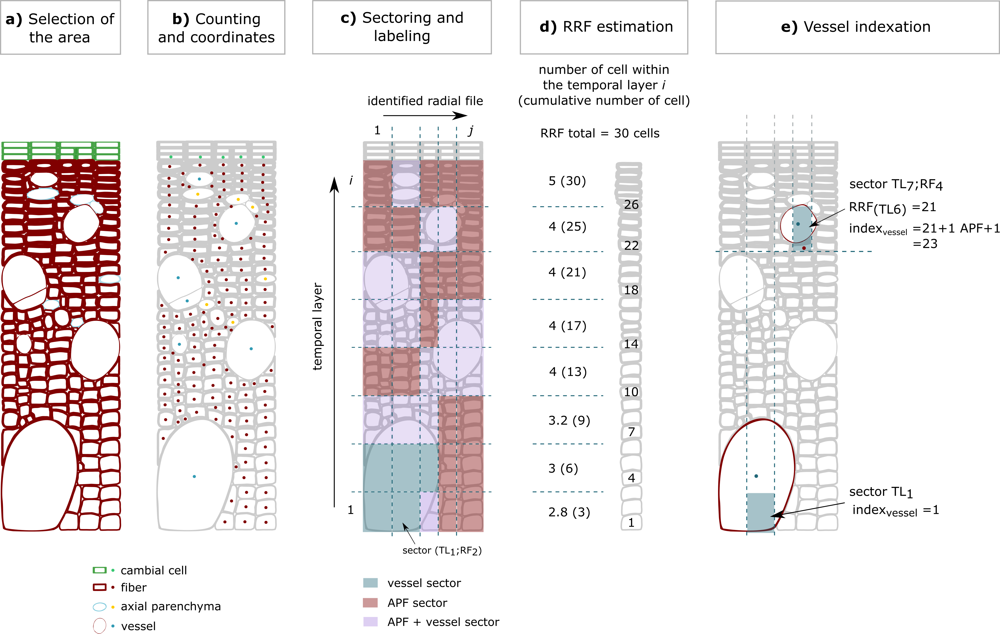

# ReferentialRadialFile
Supporting Git repository sharing R scripts and functions to get xylogenesis dynamic in heterogeneous xylem structure.

Reference for more details: [E. Noyer, M. Stojanović, P. Horáček & G. Pérez-de-Lis. "Towards a better understanding of angiosperm xylogenesis: A new method for a cellular approach" *New Phytologist*](https://nph.onlinelibrary.wiley.com/doi/full/10.1111/nph.18959)

The current repository allows the create dataset matching with the input data used in xylogenesis studies at cellular scale (example: [Cuny *et al.* 2013](https://academic.oup.com/jxb/article/64/7/1983/581240)).

Synthetic summary of the main steps of the procedure:

## Repository organization
- **imageJ_macro**: simple home-made macro to access to cell coordinates and cell size using ImageJ software (can be improved).
- **scripts**:
    - (Fct)RRF_estimation.R: R script compiling developed functions to estimate the number of APF produced by tempral layer and the vessel indexation;
    - (C)pipeline_test.R: R script giving pipeline example and function utilization workflow.
- **input dataset**: folder compiling two example datasets of cell coordinates and vessel size from one anatomical slides per species (ash and beech) and which can be used to test the R scripts.
- **output_dataset**: datasets produced by the utilization of the (Fct)RRF_estimation.R functions.
- **output_graph**: graphics produced by the utilization of the (Fct)RRF_estimation.R functions.

## Prerequisite
Provided R scripts and input datasets allow you to test the pipeline and to get control graphics and elaborated datasets.

To use this repository, you will need a spread datasheet compiling cell coordinates and sizes. You can use the homemade imageJ macro of this repository.

Spread datasheet should include the following columns:
- cell coordinates: **X.cor**, **Y.cor**
- cell types: **Cambial cell**, **Fiber**, **Vessel**, **Axial Parenchyma**
- cell developmental phases: **Enlarging**, **Lignifying**, **Mature**
- cell lumen area (for vessel)
- area of the image analysed
- image identifier
- tree identifier
- date
- species
- type of xylem: diffuse-porous **DP**, ring-porous **RP**

## How is it working?
THe following workflow chart explain the organizational framework of the used functions:

## using R version and librairies
R 4.1.2, sp, reshape2, deldir and dplyr packages.
